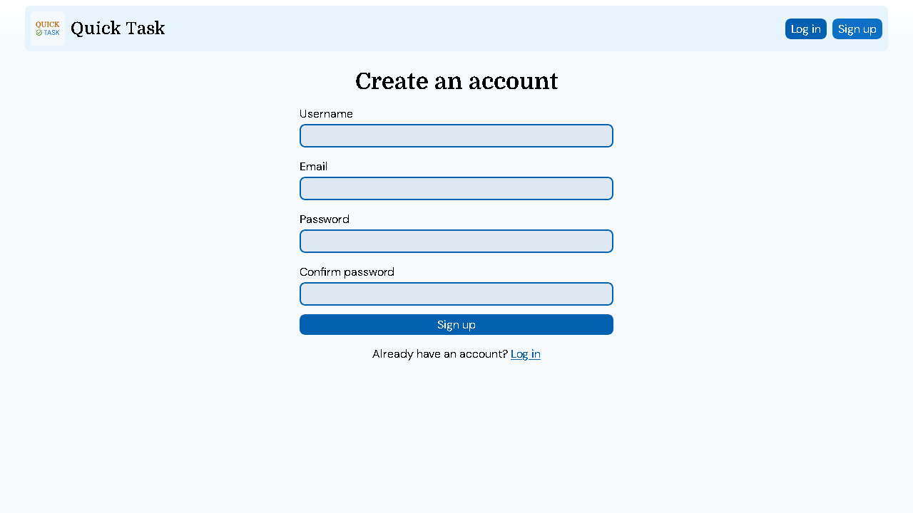
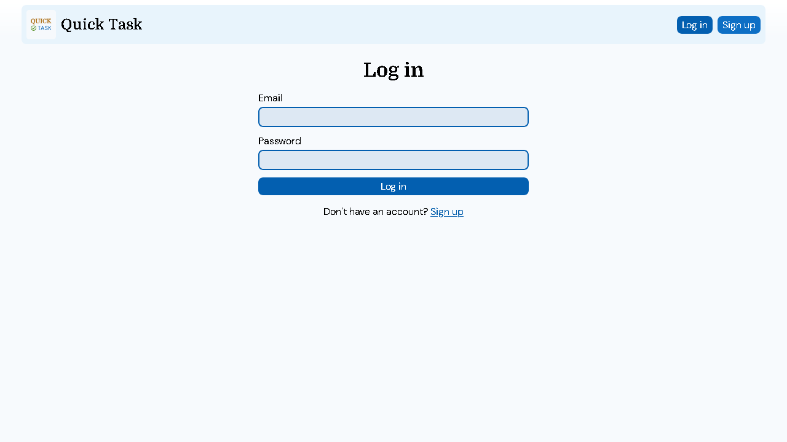
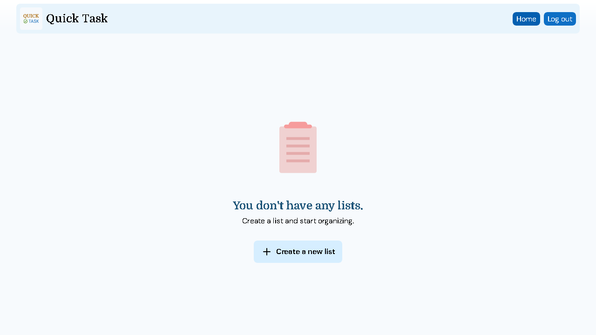
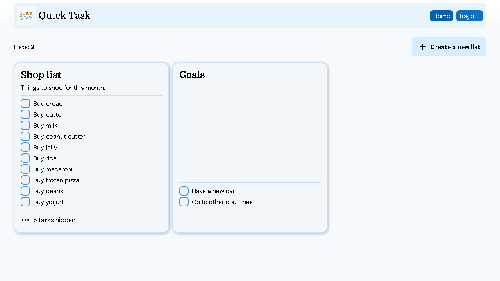
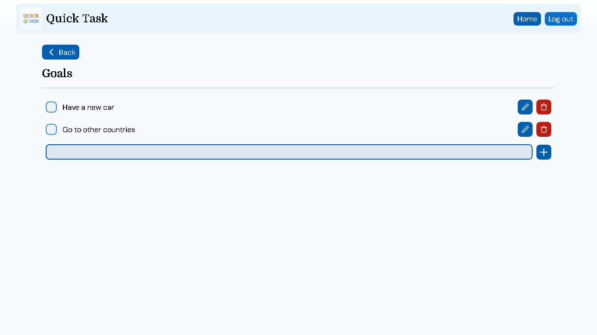

# Quick Task

A full-stack task management application that allows users to create accounts, manage multiple lists, and add items on each list. Users can mark items as completed or incomplete, as well of editing and deleting both lists and tasks.

## Contents

- [Features](#features)
- [Technologies](#technologies)
- [Screenshots](#screenshots)
- [Repository structure](#repository-structure)
- [How to run locally](#how-to-run-locally)
- [Contributors](#contributors)

## Features

1. Create an account and Log in
2. Create, rename and delete lists
3. Create, rename, delete and mark list items as completed
4. Log out or wait for authentication token to expire

## Technologies

- Front End: React, JavaScript, HTML5, CSS3
- Back End: Java, Spring Boot
- Database: MySQL

## Screenshots

## Repository structure

- **back-end/**
  - Back End part of project, API and Server Side logic
  - [**README.md** (See about tech stack and how to launch Back End part)](back-end/README.md)
- **front-end/**
  - Front End part of project, UI and Client Side app
  - [**README.md** (See about tech stack and how to launch Front End part)](front-end/README.md)

## How to run locally

> [!NOTE]  
> This project is divided into two independent applications

1. Start the backend by following the instructions in [`back-end/README.md`](back-end/README.md)
2. Start the frontend by following the instructions in [`front-end/README.md`](front-end/README.md)
3. Open http://localhost:5173/ in your browser
4. Create an account and start managing your tasks.

## Contributors

| Role      | Contributor                                                   |
| --------- | ------------------------------------------------------------- |
| Front End | [Giovanni Elias](https://github.com/GiovanniEliasDaRosa)      |
| Back End  | [Tiago Citrangulo](https://github.com/TiagoCitranguloDaSilva) |
