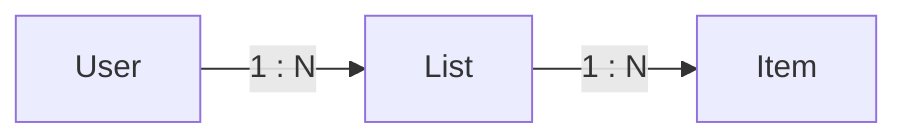
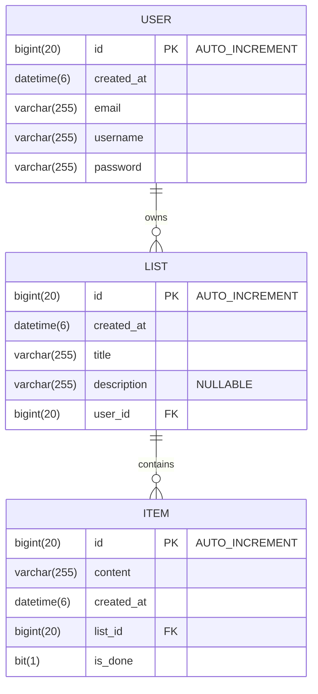

# Quick Task - Back End

This is the documentation for the Back End of Quick Task, a REST API built with Spring Boot.

## Contents

- [Technologies](#technologies)
- [Development Tools](#development-tools)
- [Features](#features)
- [Project Structure](#project-structure)
- [Database Structure](#database-structure)
- [Setup](#setup)
- [Running the Application](#running-the-application)
- [API Endpoints](#api-endpoints)

## Technologies

### Requirements

- Java 24
- Maven
- MySQL

### Frameworks & Libraries

- Spring Boot
- Spring Security
- Spring Data JPA
- Hibernate
- JWT
- Controller Advice
- DTO Pattern

## Development Tools

- **Postman** - test API requests without front end.
- **Swagger** - automatically generate interactive API documentation, this way the front end developer can easily know what requests to make where with which data and what the response might be

## Features

- User registration, login and logout
- JWT authentication
- Create, edit, and delete task lists
- Create, edit, delete, and toggle task items
- Store and retrieve data from the database

## Project Structure

| Folder      | Description                                     |
| ----------- | ----------------------------------------------- |
| config/     | Configuration classes                           |
| controller/ | REST controllers                                |
| exception/  | Custom exceptions and global exception handling |
| model/      | JPA entities                                    |
| infra/      | Infrastructure configuration                    |
| repository/ | Database access layer                           |
| request/    | Request DTOs                                    |
| response/   | Response DTOs                                   |
| service/    | Business logic                                  |

## Database Structure

### Relationships



User 1:N Lists
List 1:N Items

### Users table structure



#### Users table structure

| Name        | Type         | Null | Default | Extra          |
| ----------- | ------------ | ---- | ------- | -------------- |
| id Primary  | bigint(20)   | No   | None    | AUTO_INCREMENT |
| created_at  | datetime(6)  | No   | None    |                |
| email Index | varchar(255) | No   | None    |                |
| password    | varchar(255) | No   | None    |                |
| username    | varchar(255) | No   | None    |                |

#### Lists table structure

| Name          | Type         | Null | Default | Extra          |
| ------------- | ------------ | ---- | ------- | -------------- |
| id Primary    | bigint(20)   | No   | None    | AUTO_INCREMENT |
| created_at    | datetime(6)  | No   | None    |                |
| description   | varchar(255) | Yes  | NULL    |                |
| title         | varchar(255) | No   | None    |                |
| user_id Index | bigint(20)   | No   | None    |                |

#### Items table structure

| Name          | Type         | Null | Default | Extra          |
| ------------- | ------------ | ---- | ------- | -------------- |
| id Primary    | bigint(20)   | No   | None    | AUTO_INCREMENT |
| content       | varchar(255) | No   | None    |                |
| created_at    | datetime(6)  | No   | None    |                |
| list_id Index | bigint(20)   | No   | None    |                |
| is_done       | bit(1)       | No   | None    |                |

## Setup

### How to run locally

To run you need:

- Java JDK version 24
- MVN
- MySQL

### After installation check for versions

Check java version, it should say 24 or higher (it's recommended to run with version 24)

```sh
java --version

mvn -v
```

### Setup environment file

- Go to to the folder `./back-end/src/main/resources/`
- Duplicate `applicationExample.yaml` and rename to `application.yaml`
- Update the database values(if your database has been modified from the default values)
- Replace JWT secret with your own secure value (e.g. `secret: "tasks"`)

## Running the Application

### First-time setup

Start your MySQL server.

Create the database:

```sql
CREATE DATABASE quick_task_db;
```

### Start the back end server

Open a terminal in the `back-end/` folder and run:

```sh
mvn spring-boot:run
```

> [!TIP]
> Keep the terminal open, as it is the back-end server.

> [!IMPORTANT]
> To stop the server, press `ctrl + c`, then close the terminal window.

## API Endpoints

After starting the application, Swagger UI is available at:

http://localhost:8080/swagger-ui/index.html
